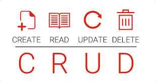

<!--
*** Thanks for checking out the Best-README-Template. If you have a suggestion
*** that would make this better, please fork the repo and create a pull request
*** or simply open an issue with the tag "enhancement".
*** Thanks again! Now go create something AMAZING! :D
-->


<!-- PROJECT SHIELDS -->
<!--
*** I'm using markdown "reference style" links for readability.
*** Reference links are enclosed in brackets [ ] instead of parentheses ( ).
*** See the bottom of this document for the declaration of the reference variables
*** for contributors-url, forks-url, etc. This is an optional, concise syntax you may use.
*** https://www.markdownguide.org/basic-syntax/#reference-style-links
-->
[![Contributors][contributors-shield]][contributors-url]
![Stargazers][stars-shield]
[![License][license-shield]][license-url]
[![LinkedIn][linkedin-shield]][linkedin-url]


<!-- PROJECT LOGO -->
<br />
<p align="center">
    
  </a>

  <h3 align="center">Sales Registry System</h3>

  <p align="center">
    CRUD system CRM type
  </p>
</p>


<!-- TABLE OF CONTENTS -->
<details open="open">
  <summary>Table of Contents</summary>
  <ol>
    <li>
      <a href="#about-the-project">About The Project</a>
      <ul>
        <li><a href="#built-with">Built With</a></li>
      </ul>
    </li>
    <li>
      <a href="#getting-started">Getting Started</a>
      <ul>
        <li><a href="#prerequisites">Prerequisites</a></li>
        <li><a href="#installation">Installation</a></li>
      </ul>
    </li>
    <li><a href="#license">License</a></li>
    <li><a href="#contact">Contact</a></li>
  </ol>
</details>


<!-- ABOUT THE PROJECT -->
## About The Project

CRUD sales registry system CRM type for companies which need a tracking report system with diverse department approvals.


### Built With

This section should list any major frameworks that you built your project using. Leave any add-ons/plugins for the acknowledgements section. Here are a few examples.
* [Bootstrap](https://getbootstrap.com)
* [JQuery](https://jquery.com)
* [Chart.js](https://www.chartjs.org/)
* [PHP 7.4.21](https://www.php.net/)
* [MYSQL 8.0.13-4](https://dev.mysql.com/downloads/mysql/)


<!-- GETTING STARTED -->
## Getting Started

You should have knowledge of how to install/set up and use the previous software and libraries described in <a href="#built-with">Built With</a> section, and have already a database with the tables described in the documentation folder.

### Prerequisites

* You have already created the required tables in your relational database server described in "Documentacion" folder (MYSQL/POSTGRESQL)

### Installation

1. Install PHP in your server
2. Clone the repository
  ```sh
  git clone https://github.com/ANVRRT/CCLaModerna.git
  ```
3. Modify the "dbh.inc.php" file located in "CCLaModerna/includes/dbh.inc.php" to set up the conection to your SQL server modifying lines 3, 4, 5, and 6 with your SQL credentials
<ul>
  <li>3 - $serverName
  <li>4 - $dBUsername
  <li>5 - $dBPassword
  <li>6 - $dBname
</ul>
  
4. Create a new company with name "SYS" and "idCompania" = "SYS" in the table "Compania", and the roles in table "Rol"
   ```MYSQL
   INSERT INTO Compania VALUES("SYS","SYS",1,null);
   INSERT INTO Rol VALUES("SYS","ADM");
   ```
5. Deploy your site
6. Once deployed, go to yoursite/php/register.php and create a new user filling up the form with your "idCompania" = "SYS" and "rol" = "ADM" <br><br><br>

[![Product Name Screen Shot][product-screenshot]]


8. Keep in mind that this are the unique roles set up in the system, and the roles permissions can't be set dynamically in the system (Without touching the code) but the user permissions can.   This are the roles that are set ADM, DIR, FAC, CXC, VTA, CST, ING, PLN, FEC and need to be added into your SQL table "Rol".
  

<!-- LICENSE -->
## License

Distributed under a specific License. See `LICENSE` for more information.


<!-- CONTACT -->
## Contact


Alberto Navarrete Ramírez (Lead Programmer) [Linkedin](https://www.linkedin.com/in/albertonr/) - albertonavarreteramirez@gmail.com <br>


<!-- MARKDOWN LINKS & IMAGES -->
<!-- https://www.markdownguide.org/basic-syntax/#reference-style-links -->
[contributors-shield]: https://img.shields.io/badge/CONTRIBUTORS-10-GREEN?style=for-the-badge
[contributors-url]: https://github.com/ANVRRT-A01422954/CCLaModerna/graphs/contributors
[stars-shield]: https://img.shields.io/badge/STARS-0-yellow?style=for-the-badge
[license-shield]: https://img.shields.io/badge/LICENSE-%20-green?style=for-the-badge
[license-url]: https://github.com/ANVRRT/Sales-registry-system-CRUD/blob/main/license.txt
[linkedin-shield]: https://img.shields.io/badge/-LinkedIn-black.svg?style=for-the-badge&logo=linkedin&colorB=555
[linkedin-url]: https://www.linkedin.com/in/albertonr/
[product-screenshot]: https://github.com/ANVRRT/Sales-registry-system-CRUD/blob/main/img/registerform.PNG

